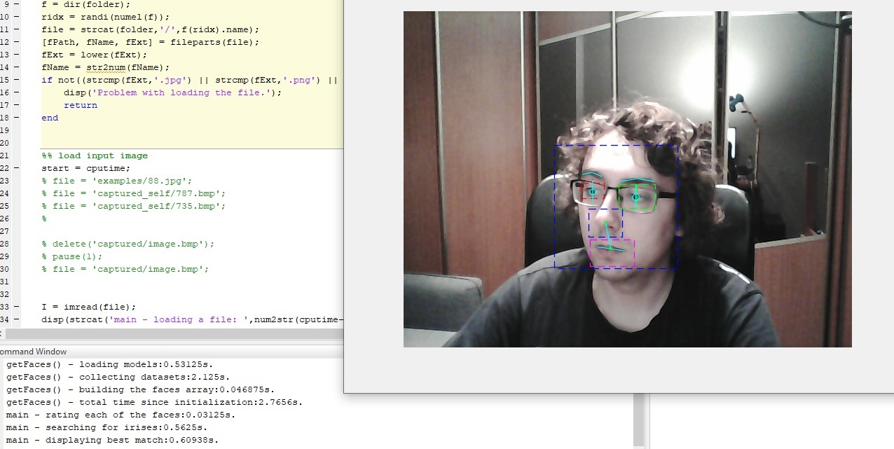

## Welcome!

My name is Mateusz and here I want to share with you results from some of my projects.

The portfolio contains selected DIY projects, screenshots of some programs that I created, projects from my time at the university and that sort of stuff. I tried to include some details about each of them. A little disclaimer. Those are not commercial projects. I’ve done them when I was an undergrad only for educational purposes.

### PWM rectifier
#PowerElectronics #Matlab #Simulink #Simscape #LTSpice

  

    
    
  

  

    
    
  

  

    
    
  

My master’s thesis was entitled: „Analysis of the operation of active transistor rectifiers”. I started with a mathematical model of such inverter, then in Matlab/Simulink I designed a simulation of single-phase PWM rectifier. Since the simulations went well and I still had time I decided to make an actual converter. With help of LTSpice I designed driver  and required sensors. Making boards took some time but in the end they looked quite good I believe. As controller a popular _Blue-Pill_, STM32 was used.   

### Computer desk DIY
#diy #woodworking #desk #workstation

  

    
    
  

  

    
  

Upgrade of my old desk with a single monitor to a desk with two monitors, a shelf for books, adjustable length and its own lighting panel.

### Face features recognition
#ImageRecognition

  

    
  

My small hobby project. Was bored one day and decided to play around some image processing. Despite the library that I used had built-in models for recognition of face, eyes, mouth etc. the challenge was to obtain their actual positions.

### Series resonant inverter
#PowerElectronics #LTSpice #Resonance #Inverter #Eagle 

  

    
    
  

  

    
    
  

And here you can see my first power electronics circuit – a resonant inverter. This is model that I build for my BEng Thesis. The pictures show a series resonant circuit, powered from a full bridge inverter based on 4 MOS transistors, Eagle schematic of a MOS driver, Eagle board of a control circuit and oscilloscope measurements on the tank circuit. From the time perspective, there are a lot of things that I'd do differently today, but as I mentioned before it was my first converter and it served mostly as my own educational playground. I definitely have learned a lot from this project. It worked, and I was happy about it. 

### Security app for Android
#security #android #AndroidStudio #Java #IPcamera #php

  

    
    
  

There were many burglaries where I lived, and I decided to protect myself somehow. I had my old smartphone and thought about using it as IP camera. Downloaded some ready apps but they didn’t satisfy me.  I decided to program my own application for that purpose. How it worked: the smartphone takes pictures few times a second. The pictures are analyzed if there was a motion and if so it calculates how much part of the screen has changed. If it crosses certain threshold SMS/email Is send and the picture is being uploaded via FTP to the server. There is also a website, where you can watch recent alarms and certain details (how much memory is left or what was the battery level during the alarm). There’s also simple protection for overloading the hosting capacity – it automatically removes the oldest pictures from the server if there are too many of them.

### PSIM project - PWM rectifier + DFOC + PMSM + active load
#PowerElectronics #PSIM #UniProjects

  

    
    
  

  

    
    
  

In the 9th semester we had the project of “Computer aided modeling and design of control systems” course.  We had to make power electronic simulation model of choice in a group of 2. Together with my colleague Tomek we decided to model a system of PMSM motor supplied from the grid with use of a PWM rectifier and vector-based inverter. The simulations were performed with PSIM software. Topologies used were typical for such application, you can see them in the attached screens. 

### Game bots
#programming #autohotkey #bot

  

    
    
  

  

    
    
  

I used to like playing games. Some of them however required a player to perform tedious and repetitive tasks. As a lazy person but also someone who had some programming and control skills I couldn’t resist but to come up with solution to automate those tasks. Initially, those were simple scripts, without any GUI, and designed to automate up to few tasks at once. However, I tend to make more and more advanced scripts. My bots contained an extensive graphical interface, could automate a lot of tasks simultaneously, had many different widgets, included A* pathfinding algorithms, in-bot scripts thanks to my own interpreter. My biggest achievement in this field was making an API that based on image processing was able to obtain over 100 informations from the game window in less than 0.1 second.

### Control for pump station
#EE #SoftStart #SEE Electrical #UniProjects

  

    
  

It’s a project from the 7th semester. We had to desing a solution to control to the liquid level in the reservoir with a pump driven by an induction motor with a soft starter. Project requirements were: 1) Manual / automatic control, 2) protection against dry running, short circuit, overload, 3) to perform calculations and estimate the cost of the elements.
